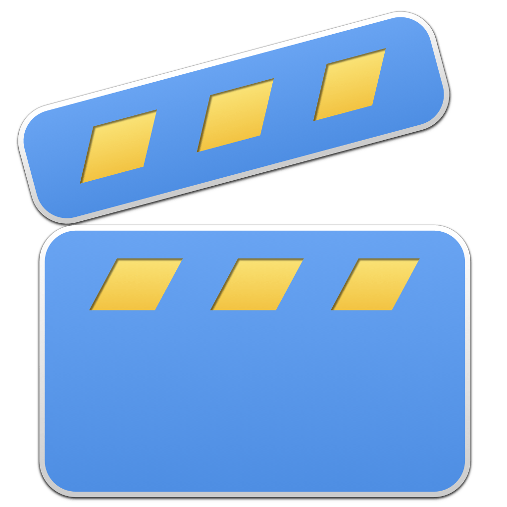

<p align="center">
    
</p>

<p align="center">
    
    
    <a href="https://danielsaidi.github.io/VideoKit"></a>
    <a href="https://github.com/danielsaidi/VideoKit/blob/master/LICENSE"></a>
    <a href="https://github.com/sponsors/danielsaidi"></a>
</p>


# VideoKit

VideoKit is a SwiftUI library with a configurable ``VideoPlayer`` view, and other utilities like a video splash screen.

<p align="center">
    
</p>

Unlike the AVKit VideoPlayer, VideoKit's ``VideoPlayer`` can be configured to creat extend, and the video splash screen utilities make it easy to create a video splash screen that plays when your app launches.

VideoKit supports iOS, iPadOS, macOS Catalyst, tvOS, and visionOS.


## Installation

VideoKit can be installed with the Swift Package Manager:

```
https://github.com/danielsaidi/VideoKit.git
```


## Support My Work

You can [become a sponsor][Sponsors] to help me dedicate more time on my various [open-source tools][OpenSource]. Every contribution, no matter the size, makes a real difference in keeping these tools free and actively developed.


## Getting Started

### Video Player

To add a video player to your app, just add a `VideoPlayer` to any view, and use the `.videoPlayerConfiguration` view modifier to configure it:

```swift
import SwiftUI
import VideoKit

struct MyView: View {

    var body: some View {
        VideoPlayer(
            videoURL: VideoPlayer.sampleVideoURL
        )
        .aspectRatio(16/9, contentMode: .fit)
        .videoPlayerConfiguration { player in
            player.showsPlaybackControls = false
        }
    }
}
```

### Video Splash Screen

To add a video splash screen to your app, like in many of the major video streaming apps, just apply the `.videoSplashScreen` view modifier to the root view of your app:

```swift
import SwiftUI
import VideoKit

struct ContentView: View {

    var body: some View {
        Text("Hello, world")
            .videoSplashScreen(
                videoURL: VideoPlayer.sampleVideoURL,
                duration: 3,
                content: { $0.background(Color.red) }
            )
            .videoSplashScreenConfiguration(.init(
                contentMode: .fit,
                dismissAnimation: .linear(duration: 4)
            ))
    }
}
```

The splash screen will automatically dismiss when the video stops playing.


## Documentation

The online [documentation][Documentation] has more information, articles, code examples, etc.


## Demo Application

The `Demo` folder has a demo app that lets you explore the library.


## Contact

Feel free to reach out if you have questions, or want to contribute in any way:

* Website: [danielsaidi.com][Website]
* E-mail: [daniel.saidi@gmail.com][Email]
* Bluesky: [@danielsaidi@bsky.social][Bluesky]
* Mastodon: [@danielsaidi@mastodon.social][Mastodon]


## License

VideoKit is available under the MIT license. See the [LICENSE][License] file for more info.


[Email]: mailto:daniel.saidi@gmail.com
[Website]: https://danielsaidi.com
[GitHub]: https://github.com/danielsaidi
[OpenSource]: https://danielsaidi.com/opensource
[Sponsors]: https://github.com/sponsors/danielsaidi

[Bluesky]: https://bsky.app/profile/danielsaidi.bsky.social
[Mastodon]: https://mastodon.social/@danielsaidi
[Twitter]: https://twitter.com/danielsaidi

[Documentation]: https://danielsaidi.github.io/VideoKit
[Getting-Started]: https://danielsaidi.github.io/VideoKit/documentation/videokit/getting-started
[License]: https://github.com/danielsaidi/VideoKit/blob/master/LICENSE
