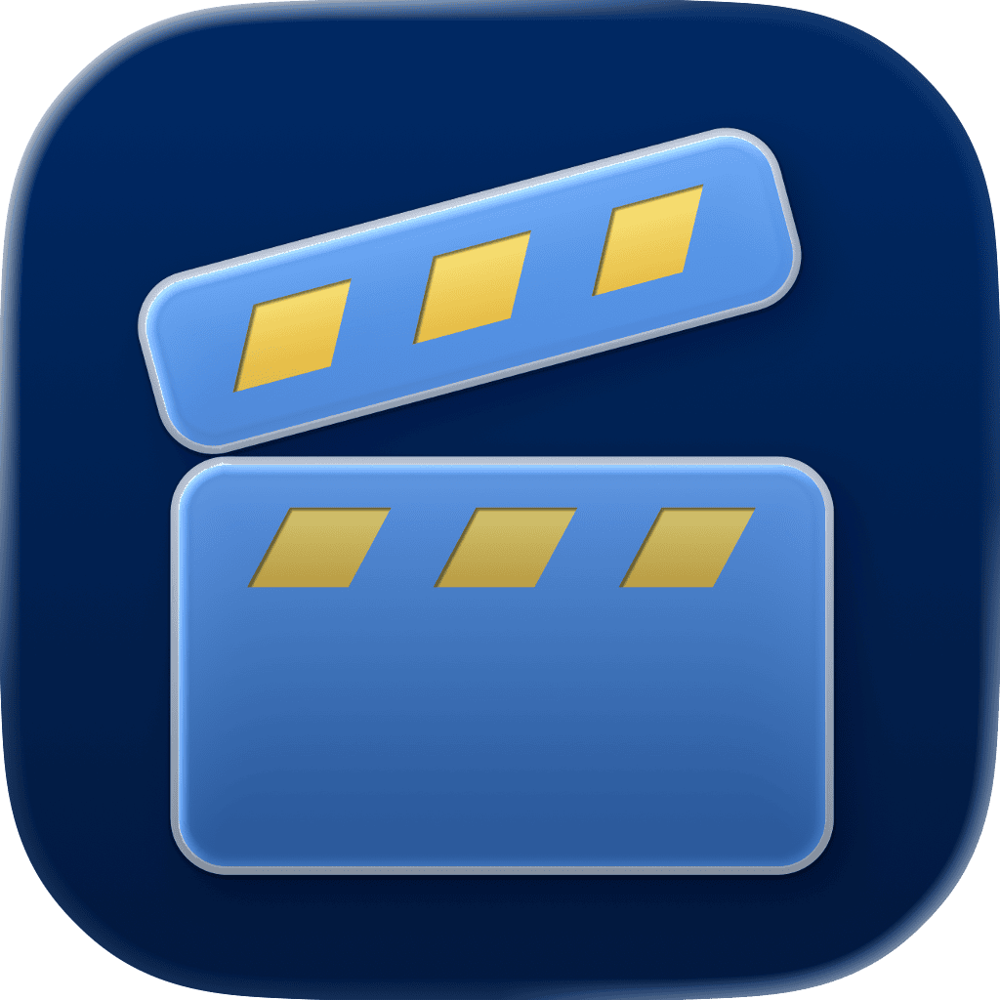

<p align="center">
    
</p>

<p align="center">
    
    
    <a href="https://danielsaidi.github.io/VideoKit"></a>
    <a href="https://github.com/danielsaidi/VideoKit/blob/master/LICENSE"></a>
</p>


# VideoKit

VideoKit is a SwiftUI library with a configurable ``VideoPlayer`` view, and other utilities like a `VideoSplashScreen`, views, sample data and Chromecast support.

<p align="center">
    
</p>

Unlike AVKit's VideoPlayer, VideoKit's ``VideoPlayer`` can be configured to great extent. It also lets you observe the current player time and can trigger a custom action when the player reaches the end.


## Installation

VideoKit can be installed with the Swift Package Manager:

```
https://github.com/danielsaidi/VideoKit.git
```

> [!IMPORTANT]  
> For remote video playback to work in macOS Catalyst, you must enable "Outgoing Connections (Client)" under "Signing & Capabilities > App Sandbox" and enable "App Transport Security Settings > Allow Arbitrary Loads" (for more security, specify allowed domains) under the app's "Info" configuration.


## Supported Platforms

VideoKit supports iOS 15, iPadOS 15, macOS Catalyst 15, tvOS 15, and visionOS 1.


## Features

VideoKit supports a bunch of video-related features:

* 🎬 Video Player - A custom video player view.
* ✨ Video Splash Screen - A video-based splash screen that plays when your app launches.
* 🖼️ Views - A bunch of video-related views and modifiers.
* 🗞️ Pagination - Built-in pagination support.
* 🍬 Sample Data - Free samples to use while developing.

VideoKit also includes Chromecast support:

* 📽️ Chromecast SDK - Google Cast dependency.

See the [documentation][Documentation] for more information.


## Getting Started

To add video content to your app, just add a ``VideoPlayer`` with a URL to the content you want to play:

```swift
struct ContentView: View {

    @State var videoTime = TimeInterval.zero

    var body: some View {
        VideoPlayer(
            videoURL: VideoPlayer.sampleVideoURL,
            time: $videoTime,
            configuration: .init(autoPlay: false),
            controllerConfiguration: { controller in
                controller.showsPlaybackControls = false
            },
            didPlayToEndAction: { print("The end") }
        )
        .aspectRatio(16/9, contentMode: .fit)
    }
}
```

You can inject a time binding which lets you persist the player time and resume playback, inject custom player and controller configurations, and a `didPlayToEndAction` to trigger when playback ends.  

To add video splash screen, just apply a ``.videoSplashScreen(videoURL:configuration:)`` to your root view:

```swift
struct ContentView: View {

    var body: some View {
        Text("Hello, world")
            .videoSplashScreen(
                videoURL: VideoPlayer.sampleVideoURL,
                configuration: .init(
                    dismissAnimation: .linear(duration: 2),
                    maxDisplayDuration: 2
                ),
                videoPlayerView: { videoPlayer in
                    Color.red
                    videoPlayer.aspectRatio(contentMode: .fit)
                }
            )
    }
}
```

You can pass in a configuration to customize the splash screen, and customize the `videoPlayerView`.

See the [getting-started guide](https://danielsaidi.github.io/VideoKit/documentation/videokit/getting-started-article) for more information.


## Documentation

The online [documentation][Documentation] has more information, articles, code examples, etc.


## Demo Application

The `Demo` folder has a demo app that lets you explore the library.


## Support My Work

You can [become a sponsor][Sponsors] to help me dedicate more time on my various [open-source tools][OpenSource]. Every contribution, no matter the size, makes a real difference in keeping these tools free and actively developed.


## Contact

Feel free to reach out if you have questions, or want to contribute in any way:

* Website: [danielsaidi.com][Website]
* E-mail: [daniel.saidi@gmail.com][Email]
* Bluesky: [@danielsaidi@bsky.social][Bluesky]
* Mastodon: [@danielsaidi@mastodon.social][Mastodon]


## License

VideoKit is available under the MIT license. See the [LICENSE][License] file for more info.


[Email]: mailto:daniel.saidi@gmail.com
[Website]: https://danielsaidi.com
[GitHub]: https://github.com/danielsaidi
[OpenSource]: https://danielsaidi.com/opensource
[Sponsors]: https://github.com/sponsors/danielsaidi

[Bluesky]: https://bsky.app/profile/danielsaidi.bsky.social
[Mastodon]: https://mastodon.social/@danielsaidi
[Twitter]: https://twitter.com/danielsaidi

[Documentation]: https://danielsaidi.github.io/VideoKit
[Getting-Started]: https://danielsaidi.github.io/VideoKit/documentation/videokit/getting-started-article
[License]: https://github.com/danielsaidi/VideoKit/blob/master/LICENSE
